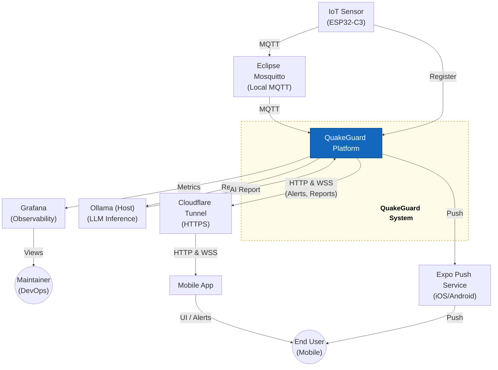

# System Context Diagram — QuakeGuard

> Level 1 (System Context): shows the QuakeGuard system and the external actors/systems that interact with it.

```mermaid
%%{init: {"themeVariables": {"fontSize": "26px"}}}%%
flowchart TD
    user(("End User\n(Mobile)"))
    maintainer(("Maintainer\n(DevOps)"))
    mobile["Mobile App"]
    sensor["IoT Sensor\n(ESP32-C3)"]

    subgraph sys [ ]
        direction LR
        quakeguard["QuakeGuard Platform"] ~~~ label["QuakeGuard System"]
    end
    style sys fill:#fefce8,stroke:#d4af37,stroke-width:2px,stroke-dasharray: 5 5
    style label fill:none,stroke:none,color:#000,font-weight:bold,font-size:24px

    mosquitto["Eclipse Mosquitto\n(Local MQTT)"]
    ollama["Ollama (Host)\n(LLM Inference)"]
    cloudflare["Cloudflare Tunnel\n(HTTPS)"]
    expo["Expo Push Service\n(iOS/Android)"]
    grafana["Grafana\n(Observability)"]

    sensor -- "MQTT" --> mosquitto
    mosquitto -- "MQTT" --> quakeguard
    sensor -- "Register" --> quakeguard

    quakeguard -- "Metrics" --> grafana
    grafana -- "Views" --> maintainer
    
    quakeguard -- "Request" --> ollama
    ollama -- "AI Report" --> quakeguard
    
    quakeguard -- "HTTP & WSS\n(Alerts, Reports)" --> cloudflare
    cloudflare -- "HTTP & WSS" --> mobile
    mobile -- "UI / Alerts" --> user
    
    quakeguard -- "Push" ---> expo
    expo -- "Push" --> user

    style quakeguard fill:#1168bd,stroke:#0b4884,color:#ffffff,stroke-width:2px
```

