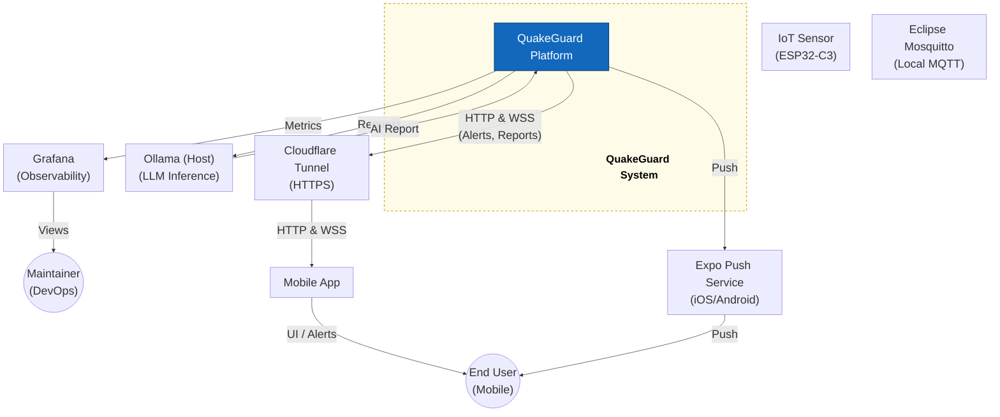
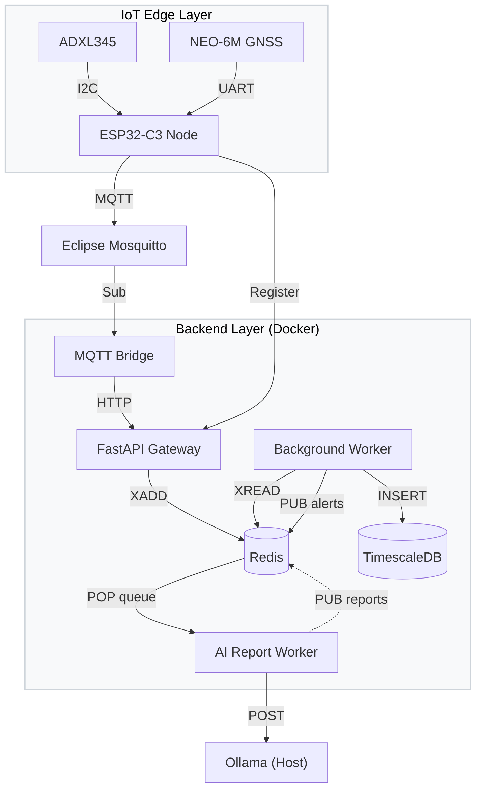
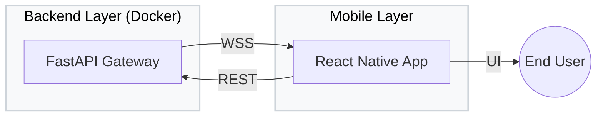

# System Context Diagram — QuakeGuard

> Level 1 (System Context): shows the QuakeGuard system and the external actors/systems that interact with it.

## Container-Level Breakdown (a. Data Ingestion)

<!--
FIX (Figure 2):
- "PUB reports" was overlapping "POP queue" because both edges ran between
  ai_worker and redis in the same direction. Reversed the POP queue edge
  (redis -> ai_worker, since the worker is the one popping/reading) which
  gives dagre two distinct paths instead of two parallel ones on top of
  each other.
- Reordered node declarations inside the backend subgraph (worker declared
  before mqtt_bridge/api) so the "Register" edge from the ESP32 node no
  longer crosses the "HTTP" edge from the MQTT Bridge to FastAPI Gateway.
-->

## Container-Level Breakdown (b. Mobile Interaction)

<!--
FIX (Figure 3):
- Only content changed: direction TD -> LR. The old top-down layout was
  tall and narrow (aspect ~0.6:1); at `width: 100%` on the page it had to
  be blown up a lot to fill the column, which is what made it look
  "enormous" and pixelated. The wide/short LR layout needs far less
  upscaling to fill the same width, so it stays crisp and looks
  proportionate. Rendered at a higher raster scale (see notes.md) for
  extra sharpness on top of that.
-->

