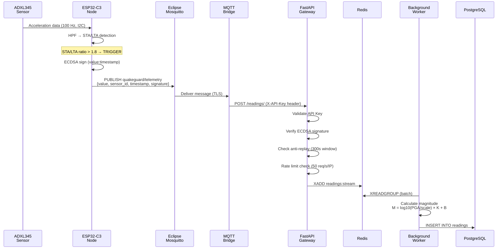
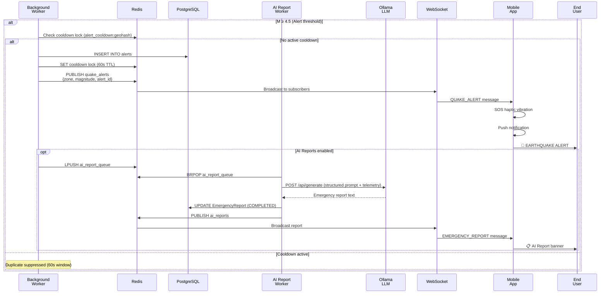

# Sequence Diagram — Alert Delivery (Earthquake Detection → Mobile Alert)

## a. Event Ingestion

<!--
FIX (Figure 8): "testo piccolo e diagramma che esce dalla pagina".
Bumped fonts 20/18/18 -> 22/20/20 and tightened actor/message/box/note
margins so the extra font size didn't blow up the footprint. Net effect:
height dropped from 904px to ~808px at the same width, giving a wider,
flatter aspect ratio (~1.94:1) that leaves much more headroom against the
page. See notes.md for the companion Typst fix needed to fully guarantee
no overflow, since Figures 8+9 share one page.
-->

## b. Alert Delivery & AI Report

<!--
FIX (Figure 9): same treatment as Part A. This one was the taller of the
two (nested alt/opt blocks), so it benefited the most: height dropped
from 1054px to ~788px at the same width (~1.99:1 aspect), roughly a 25%
reduction. Fonts bumped 20/18/18 -> 22/20/20.
-->

