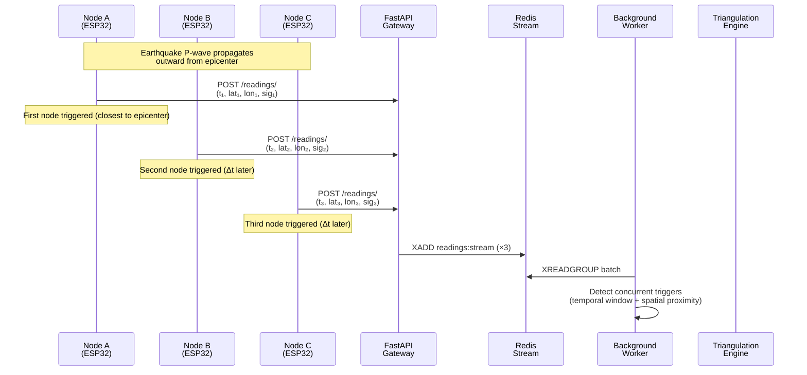
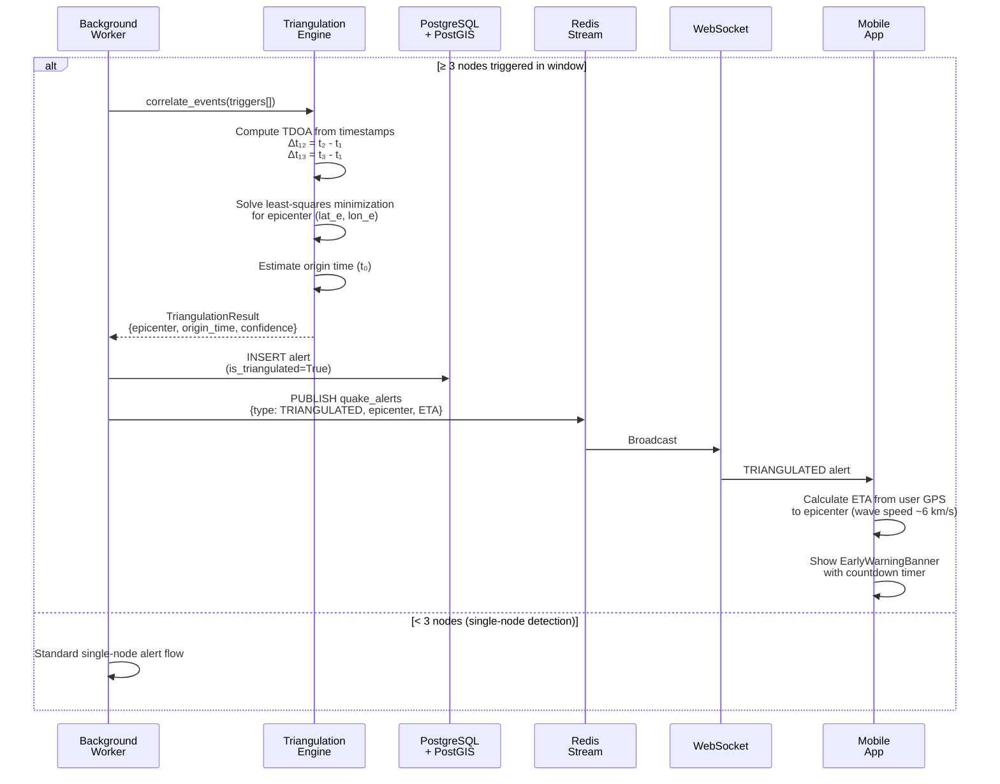

# Sequence Diagram — Multi-Node Triangulation

## a. Event Correlation

```mermaid
%%{init: {"sequence": {"actorFontSize": 20, "messageFontSize": 18, "noteFontSize": 18}}}%%
sequenceDiagram
    participant N1 as Node A<br/>(ESP32)
    participant N2 as Node B<br/>(ESP32)
    participant N3 as Node C<br/>(ESP32)
    participant API as FastAPI<br/>Gateway
    participant Redis as Redis<br/>Stream
    participant Worker as Background<br/>Worker
    participant Tri as Triangulation<br/>Engine

    Note over N1,N3: Earthquake P-wave propagates<br/>outward from epicenter

    N1->>API: POST /readings/<br/>(t₁, lat₁, lon₁, sig₁)
    Note over N1: First node triggered (closest to epicenter)

    N2->>API: POST /readings/<br/>(t₂, lat₂, lon₂, sig₂)
    Note over N2: Second node triggered (Δt later)

    N3->>API: POST /readings/<br/>(t₃, lat₃, lon₃, sig₃)
    Note over N3: Third node triggered (Δt later)

    API->>Redis: XADD readings:stream (×3)

    Worker->>Redis: XREADGROUP batch
    Worker->>Worker: Detect concurrent triggers<br/>(temporal window + spatial proximity)
```

## b. Triangulation & Broadcasting

```mermaid
%%{init: {"sequence": {"actorFontSize": 20, "messageFontSize": 18, "noteFontSize": 18}}}%%
sequenceDiagram
    participant Worker as Background<br/>Worker
    participant Tri as Triangulation<br/>Engine
    participant DB as PostgreSQL<br/>+ PostGIS
    participant Redis as Redis<br/>Stream
    participant WS as WebSocket
    participant App as Mobile<br/>App

    alt ≥ 3 nodes triggered in window
        Worker->>Tri: correlate_events(triggers[])

        Tri->>Tri: Compute TDOA from timestamps<br/>Δt₁₂ = t₂ - t₁<br/>Δt₁₃ = t₃ - t₁

        Tri->>Tri: Solve least-squares minimization<br/>for epicenter (lat_e, lon_e)

        Tri->>Tri: Estimate origin time (t₀)

        Tri-->>Worker: TriangulationResult<br/>{epicenter, origin_time, confidence}

        Worker->>DB: INSERT alert<br/>(is_triangulated=True)

        Worker->>Redis: PUBLISH quake_alerts<br/>{type: TRIANGULATED, epicenter, ETA}

        Redis->>WS: Broadcast
        WS->>App: TRIANGULATED alert

        App->>App: Calculate ETA from user GPS<br/>to epicenter (wave speed ~6 km/s)

        App->>App: Show EarlyWarningBanner<br/>with countdown timer

    else < 3 nodes (single-node detection)
        Worker->>Worker: Standard single-node alert flow
    end
```
