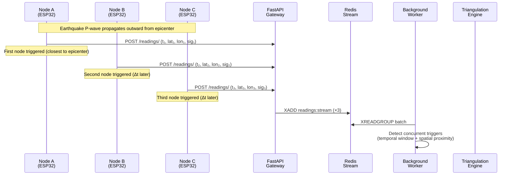
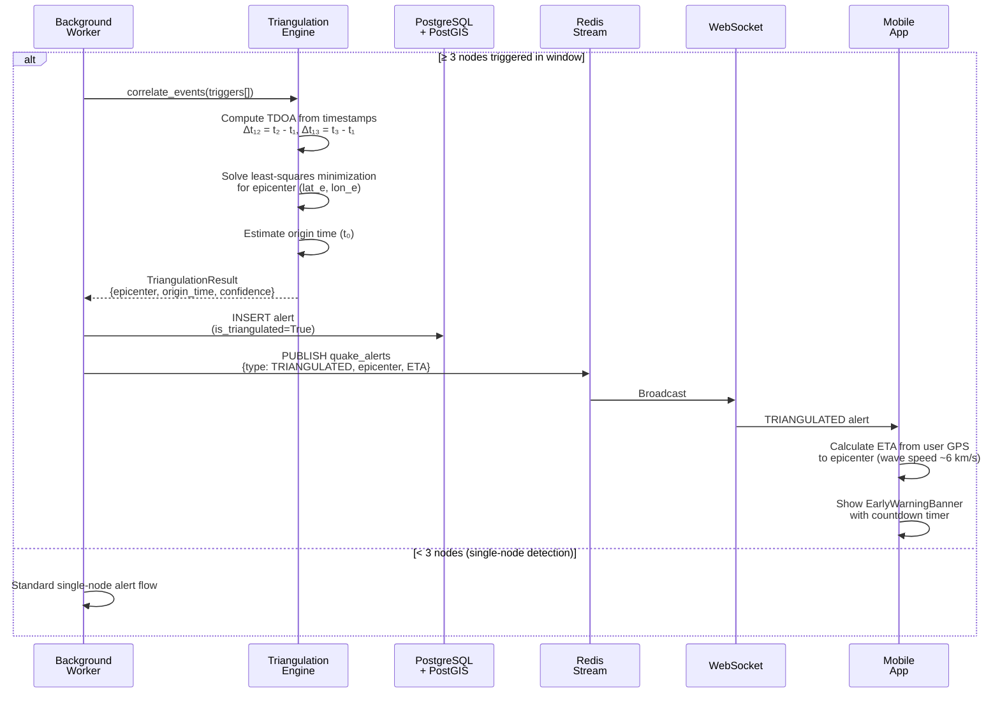

# Sequence Diagram — Multi-Node Triangulation

## a. Event Correlation

<!--
FIX (Figure 11): "diagramma che esce dalla pagina". Bumped fonts
20/18/18 -> 22/20/20 and tightened margins. Also collapsed each POST
.../readings/ message onto a single line (was wrapping via  ) which
trims some height. Result: 750px -> 562px tall at the same width, aspect
now ~2.79:1 — a lot of breathing room against the page.
-->

## b. Triangulation & Broadcasting

<!--
FIX (Figure 12): this was the worst offender for page overflow (1256px
tall — almost square). Same margin/font treatment as above, plus
collapsing multi-line messages ("Compute TDOA...", "Solve least-squares
minimization...") onto single lines where they were only wrapped for
source readability, not because they needed it. Result: 1256px -> 1124px
tall at the same width, aspect improved from ~1.25:1 to ~1.4:1 — much
closer to the landscape page's own aspect ratio, which is exactly what
minimizes the shrink factor Typst has to apply.
-->

